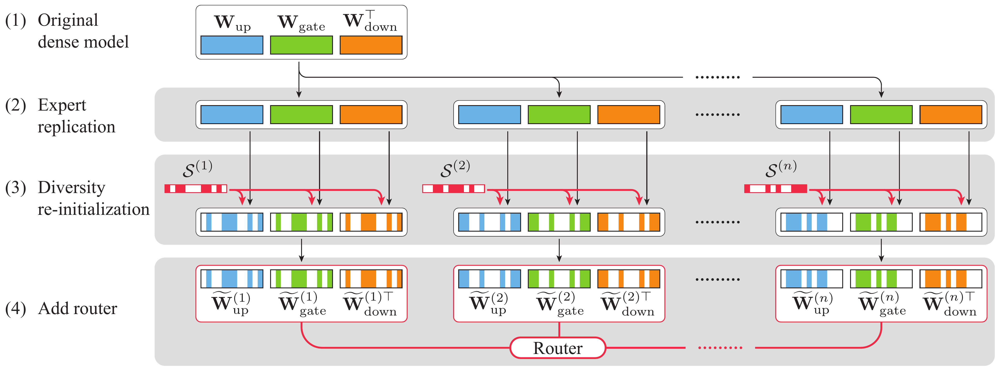

<h1 align="center">
    </a><br>
<b>Drop-Upcycling: Training Sparse Mixture of Experts with Partial Re-initialization</b><br>
</h1>

<p align="center">
  📄 <a href="https://openreview.net/forum?id=gx1wHnf5Vp">[Paper]</a> |
  🤗 <a href="https://huggingface.co/collections/llm-jp/drop-upcycling-674dc5be7bbb45e12a476b80">[Hugging Face]</a>
  📁 <a href="https://gitlab.llm-jp.nii.ac.jp/datasets/llm-jp-corpus-v3">[Dataset]</a>
  💻 <a href="https://github.com/Taishi-N324/Drop-Upcycling">[Code]</a> |
  📊 <a href="https://wandb.ai/taishi-nakamura/Drop-Upcycling">[Log]</a> |
  📰 <a href="https://llmc.nii.ac.jp/en/topics/release-of-llm-jp-3-moe-series/">[Blog]</a>
</p>

## Models Trained with Drop-Upcycling

We have released models trained using the Drop-Upcycling technique:

<p align="center">
  🤗 <a href="https://huggingface.co/llm-jp/llm-jp-3-8x13b"><strong>LLM-JP-3-8x13B</strong></a> |
  🤗 <a href="https://huggingface.co/llm-jp/llm-jp-3-8x1.8b"><strong>LLM-JP-3-8x1.8B</strong></a>
</p>

These models demonstrate the practical application of our Drop-Upcycling methodology for training efficient sparse Mixture of Experts models. For more details about the model release, please see our [blog post](https://llmc.nii.ac.jp/en/topics/release-of-llm-jp-3-moe-series/).

## Pretraining

The experiments were conducted using the following frameworks:

### Dense Model Training

- Framework: [Megatron-LM](https://github.com/llm-jp/Megatron-LM/tree/936f55676ee8d8f329a3fe12f5c4e7fdc51b46f8)

### MoE Model Training

- Framework: [moe-recipes](https://github.com/rioyokotalab/moe-recipes/tree/0860594e0e278d4b9cea547adb5d0177f0648a38)

## Evaluation

We conducted comprehensive evaluations using the evaluation framework from [swallow-llm/swallow-evaluation](https://github.com/swallow-llm/swallow-evaluation) (commit: [04948a0](https://github.com/swallow-llm/swallow-evaluation/commit/04948a0e81075cc461b80e98ba2ce483d4edb0bc)).

### Setup and Usage

For detailed instructions on setting up the evaluation environment and running the evaluation scripts, please refer to the [evaluation framework documentation](https://github.com/swallow-llm/swallow-evaluation/blob/04948a0e81075cc461b80e98ba2ce483d4edb0bc/README.md).

## Citation

```bibtex
@inproceedings{
    nakamura2025dropupcycling,
    title={Drop-Upcycling: Training Sparse Mixture of Experts with Partial Re-initialization},
    author={Taishi Nakamura and Takuya Akiba and Kazuki Fujii and Yusuke Oda and Rio Yokota and Jun Suzuki},
    booktitle={The Thirteenth International Conference on Learning Representations},
    year={2025},
    url={https://openreview.net/forum?id=gx1wHnf5Vp}
}
```
